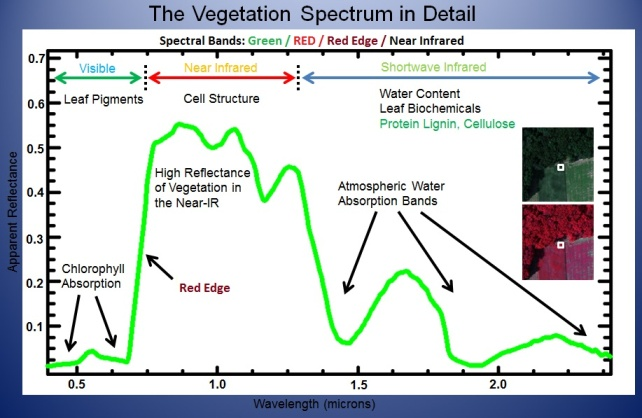
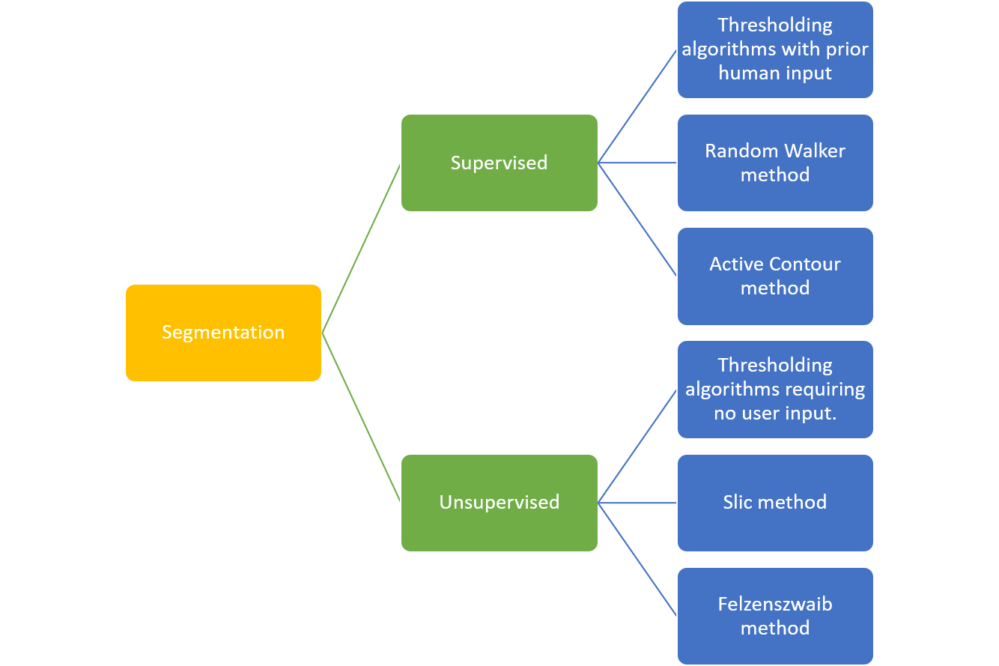
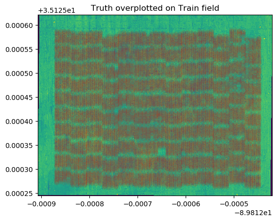

## Case study

### Part 1: ML model
Using ground truth, I first wrote a pipeline to label which positions (or set of pixel values) does a plant correspond to - or equivalently, which pixel of the trainning is a plant. Then I train ML classifers on the trainning field. The features of the pixel values of the 4 bands, NDVI, and optionally, the RGB calculated using R + B + NIR channels, and the hue (and other vegetation indices listed in config.yaml). Then, I use the ML models to determine the number of plants in the unseen test field. Howeever, this assumes that we always have information on the ground truth. 
- `config.yaml`
    + path of input data, path to output plots
    + whether or not to save figures
    + which vegetation indice to use
    + which classifier to use
- `main.py`
    + automated ML pipeline that 1. reads from config.yaml, 2. make diagnotic plots, 3. do the label on the training and ground truth, 4. calculate vegetation indices, 5. build dataframes with columns corresponding to the features to train the machine learning model on (with cross-validation), 6. fit the machine learning model, 7. run model on test field to determine number of plants.
    + run in command line: `python3 main.py config.yaml`
    + relies on dependencies within this repo: 
        * `utils.py`
        * `parser.py`
        * `split_fields_to_DF.py`
        * `visutil.py`
        * `config.py`
        * `MLutils.py`

From the logistic regressor, which has a balanced accuracy of 97%, we **find 643754** plants in the test field, corresponding to ~2% of the total number of pixels. Adding hue image didn't improve results.
    
## Motivation to use each of the channel value as the input: plants probably have different spectral properties than the rest of the whatever objects are in the satellite images.

## Motivation to use R + B + NIR: [link](https://www.mdpi.com/2072-4292/11/4/410/htm)

## Motivation to use ndvi: [link](https://www.dronezon.com/learn-about-drones-quadcopters/multispectral-sensor-drones-in-farming-yield-big-benefits/)
- The logic behind this is that healthy, growing, green vegetation must produce needed energy through photosynthesis. When plants are actively photosynthesizing, they reflect or scatter near-IR light. Absorption of these wavelengths would result in overheating and tissue damage. The visible portion of the spectrum is absorbed; however, a little more green light is reflected away, relative to blue and particularly red light.
- other vegetation indices https://midopt.com/filters-for-ndvi/

Regarding the ML models, options are:
1. logistic regression
    - chosen: simple and the fact that we have 0, 1
2. SVM
    - to explore non-linear relationships between a plant and the spectral indices, and pixels values
3. random forest classifier
    - to explore non-linear relationships between a plant and the spectral indices and vegetation indices, and pixels values

Codes to make the plants population map [# of plants per acer]: 
- `plant_analytics.py`

# Here, I use image segmentation to find plants in the training field.

- `imSeg.py`

#### MISC files in this repo:
- `case.ipynb` and `case.py`
    + testing codes for building the ML pipeline
- `imSeg.ipynb` and `imSeg.py`
    + testing codes for geospatial coordinate reference of the TIF files
    + scikit-image

Issues and challenges that I faced: 
- I may have approached this problem the wrong way than I should have in the beginning.. Perhaps I should have do image segmentation and then compare to the ground truth, instead of deploying a ML pipeline?
- domain knowledge missing and took me a while to understand the satellite images and the geosystem of the TIF file
- Just looking at the band images, the RGB composite, and ndvi image. Nothing stands out as a plant to me. Even when applying thresholds to the ndvi image, I am still uncertain how to wrap my head around a plant in these images.
- based on the latitude and longtiude of the training field, it seems like the area of the map is ~50 x 50 m^2, which seems too small, but it was not clear to me where I would have messed up. 
- Because of this reason, I don't have a sensible plant population map, but the code I have written in `plant_analytics.py` is expected to still work with sensible inputs.
- I am still uncertain about how to determine the "plant size" from the satellite image. Is it the extent of a given connected region spanned by plants? But even when overlaying the ground truth on the train field image, it's not very clear to me what plant size means.
